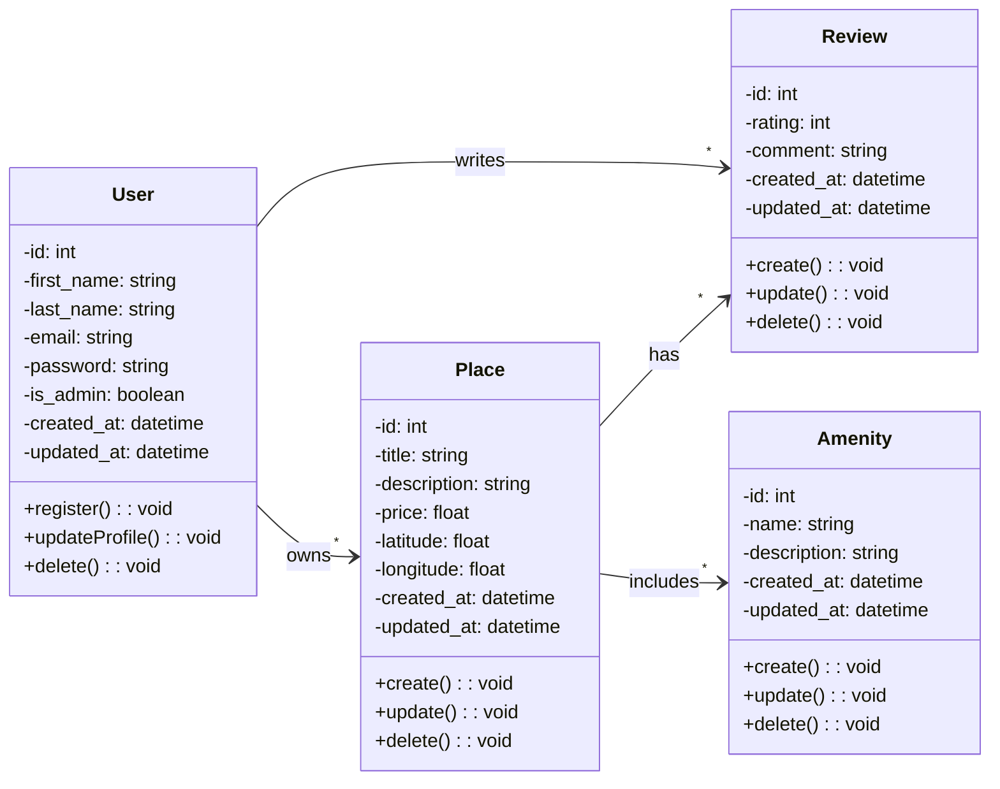
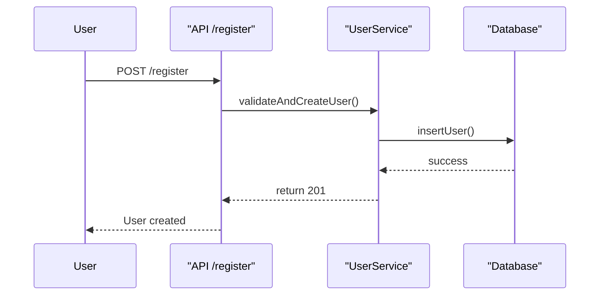
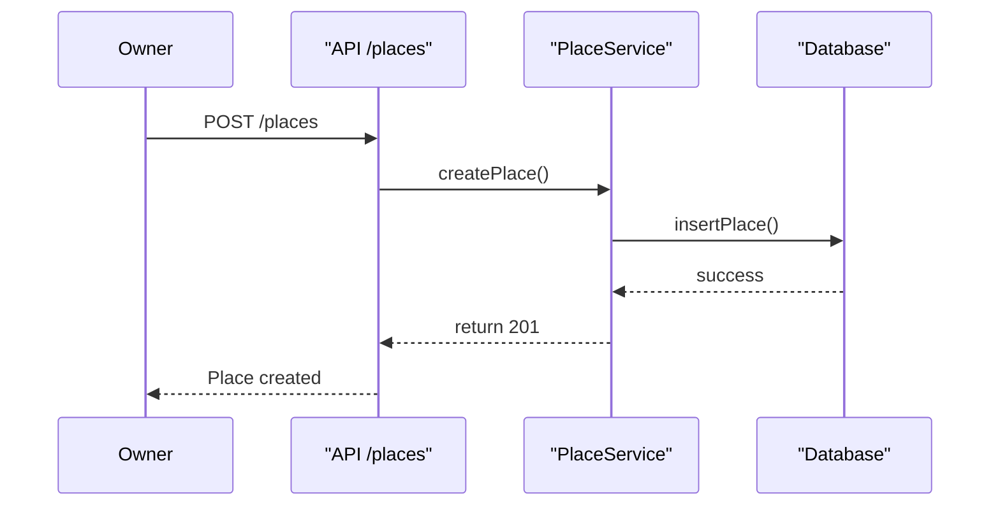
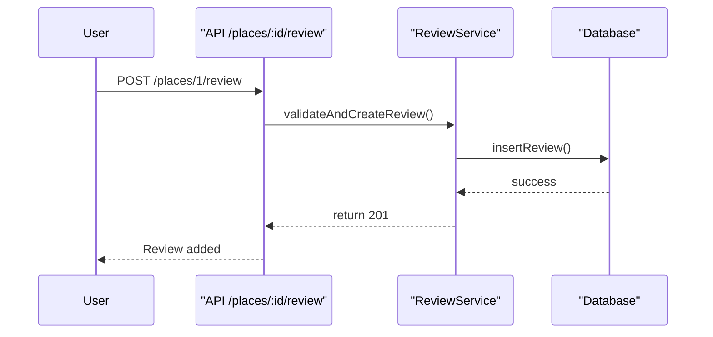
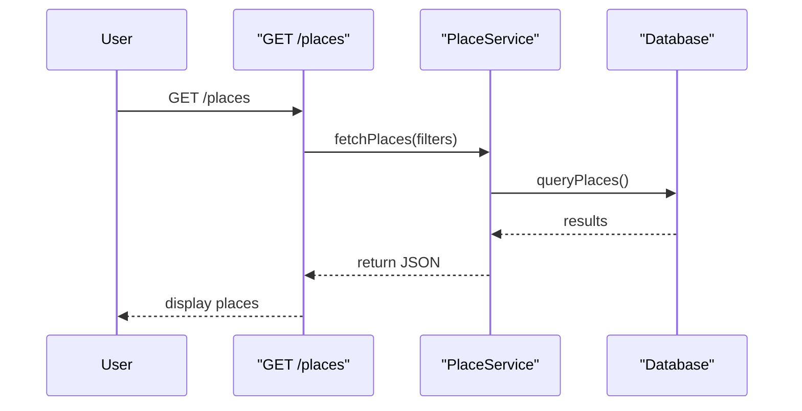

# holbertonschool-hbnb
# HBnB Evolution - Technical Documentation

##  Project Overview

**HBnB Evolution** is a simplified AirBnB-like application designed to manage users, places, reviews, and amenities. The objective of this phase is to build complete technical documentation that defines the architecture, core business logic, and data interactions within the system. This documentation will serve as a foundation for implementation.

## Team Members

* Munira Alsubaie
* Abdullah Alameeri
* Mohammed Alahmari
  
##  Table of Contents

1. [High-Level Package Diagram](#1-high-level-package-diagram)
2. [Class Diagram: Business Logic Layer](#2-class-diagram-business-logic-layer)
3. [Sequence Diagrams for API Calls](#3-sequence-diagrams-for-api-calls)
4. [Design Rationale and Explanatory Notes](#4-design-rationale-and-explanatory-notes)

---

## 1. High-Level Package Diagram

### Description

Illustrates the 3-tier architecture (Presentation, Business Logic, Persistence) and uses the **Facade Pattern** to decouple layers.

* **Presentation Layer**: Handles API endpoints, user interface interactions.
* **Business Logic Layer**: Contains core operations and validation logic.
* **Persistence Layer**: Manages database interactions.

---

## 2. Class Diagram: Business Logic Layer

### Description

UML diagram showing entities, attributes, methods, and relationships in the business logic.

---

## 3. Sequence Diagrams for API Calls

### 3.1 User Registration

### 3.2 Place Creation

### 3.3 Review Submission

### 3.4 Fetching List of Places

---

## 4. Design Rationale and Explanatory Notes

### Architecture Choices

* **Facade Pattern**: Used to simplify and standardize interactions between Presentation and Business Logic.
* **3-layered Design**: Promotes maintainability, modularity, and clear responsibility separation.

### Entity Design Decisions

* All entities include `created_at` and `updated_at` for audit.
* Relationships reflect real-world associations (e.g., Users write Reviews, Places have Amenities).

### Sequence Flow Explanation

Each API call goes through:

1. **Presentation Layer** for input/response handling.
2. **Business Logic Layer** for validation and core logic.
3. **Persistence Layer** for DB operations.

---

## Final Notes

* All diagrams were created using [Mermaid.js](https://mermaid.js.org/).
* This document is meant to serve as the primary reference for HBnB’s implementation phase.

> Prepared by Team | June 2025
