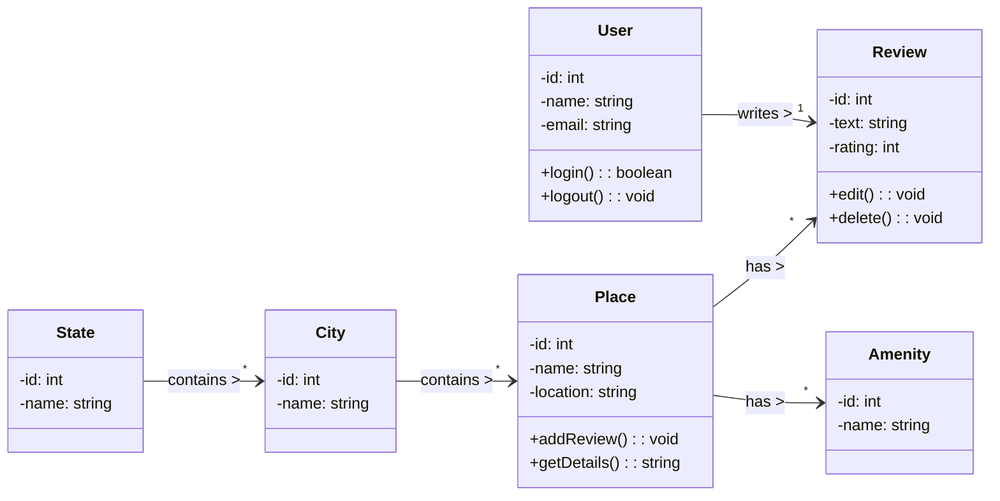
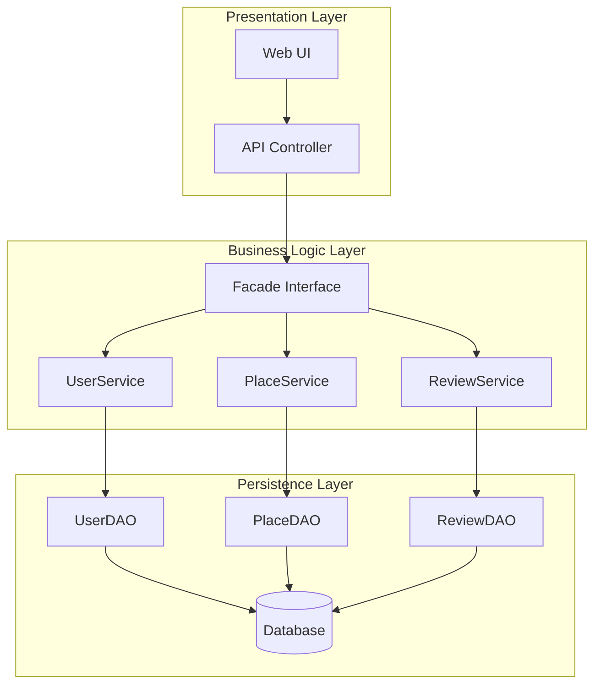

# Project Architecture

## 🎯 UML Class Diagram

```mermaid
classDiagram
    direction LR

    class User {
        -id: int
        -name: string
        -email: string
        +login(): boolean
        +logout(): void
    }

    class Place {
        -id: int
        -name: string
        -location: string
        +addReview(): void
        +getDetails(): string
    }

    class Review {
        -id: int
        -text: string
        -rating: int
        +edit(): void
        +delete(): void
    }

    class City {
        -id: int
        -name: string
    }

    class State {
        -id: int
        -name: string
    }

    class Amenity {
        -id: int
        -name: string
    }

    User --> "1" Review : writes >
    Place --> "*" Review : has >
    City --> "*" Place : contains >
    State --> "*" City : contains >
    Place --> "*" Amenity : has >
```

## 📦 High-Level Package Diagram

```mermaid
graph TD
    subgraph Presentation Layer
        A1[Web UI]
        A2[API Controller]
    end

    subgraph Business Logic Layer
        B1[UserService]
        B2[PlaceService]
        B3[ReviewService]
        F[Facade Interface]
    end

    subgraph Persistence Layer
        D1[UserDAO]
        D2[PlaceDAO]
        D3[ReviewDAO]
        DB[(Database)]
    end

    A1 --> A2
    A2 --> F
    F --> B1
    F --> B2
    F --> B3

    B1 --> D1
    B2 --> D2
    B3 --> D3

    D1 --> DB
    D2 --> DB
    D3 --> DB
```
