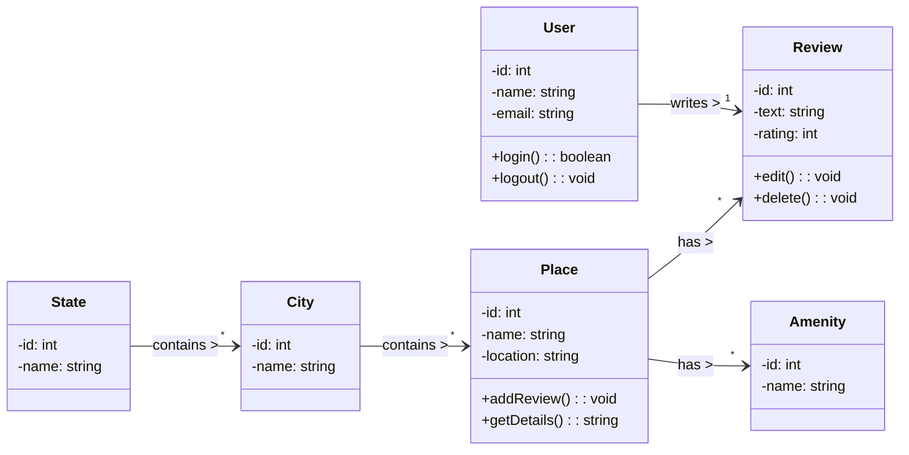
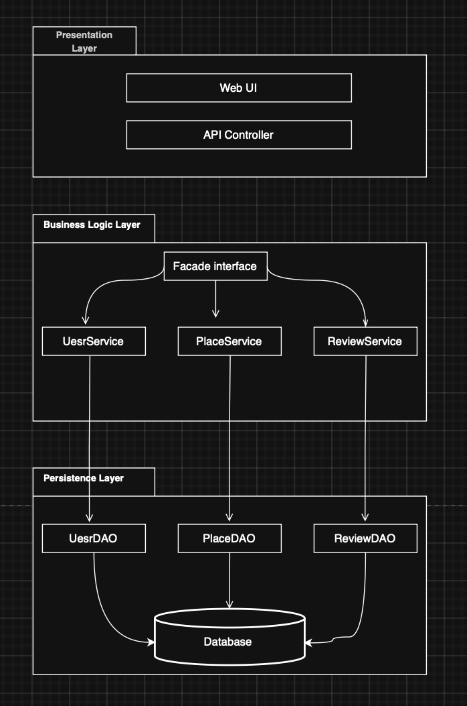

# Project Architecture

## 🎯 UML Class Diagram

```mermaid
classDiagram
    direction LR

    class User {
        -id: int
        -name: string
        -email: string
        +login(): boolean
        +logout(): void
    }

    class Place {
        -id: int
        -name: string
        -location: string
        +addReview(): void
        +getDetails(): string
    }

    class Review {
        -id: int
        -text: string
        -rating: int
        +edit(): void
        +delete(): void
    }

    class City {
        -id: int
        -name: string
    }

    class State {
        -id: int
        -name: string
    }

    class Amenity {
        -id: int
        -name: string
    }

    User --> "1" Review : writes >
    Place --> "*" Review : has >
    City --> "*" Place : contains >
    State --> "*" City : contains >
    Place --> "*" Amenity : has >
```

## 📦 Package Diagram

