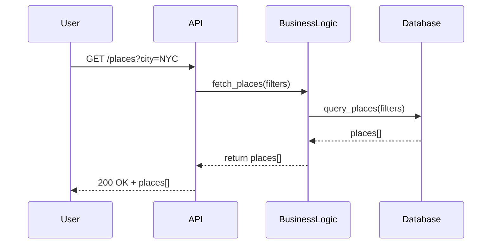

```mermaid
sequenceDiagram
    participant User
    participant API
    participant BusinessLogic
    participant Database

    User->>API: GET /places?city=NYC
    API->>BusinessLogic: fetch_places(filters)
    BusinessLogic->>Database: query_places(filters)
    Database-->>BusinessLogic: places[]
    BusinessLogic-->>API: return places[]
    API-->>User: 200 OK + places[]
```