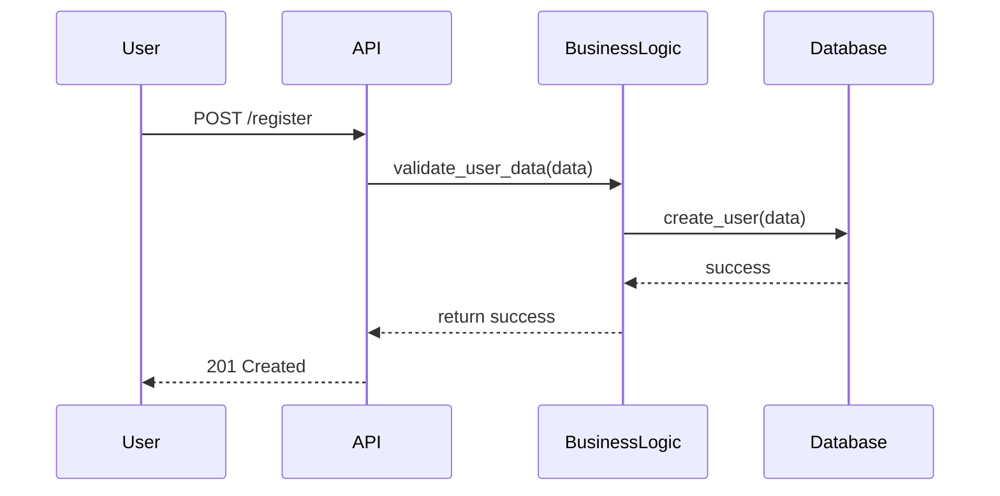

```mermaid
sequenceDiagram
    participant User
    participant API
    participant BusinessLogic
    participant Database

    User->>API: POST /register
    API->>BusinessLogic: validate_user_data(data)
    BusinessLogic->>Database: create_user(data)
    Database-->>BusinessLogic: success
    BusinessLogic-->>API: return success
    API-->>User: 201 Created
```